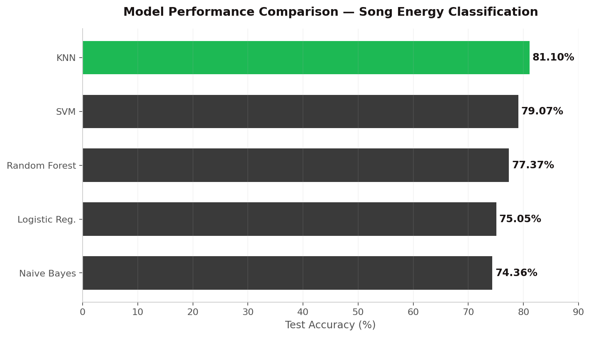
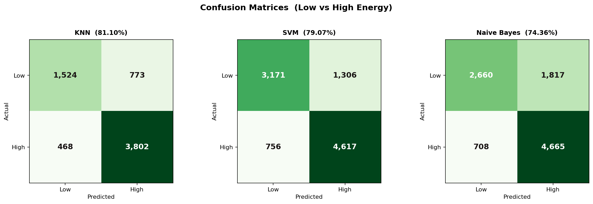
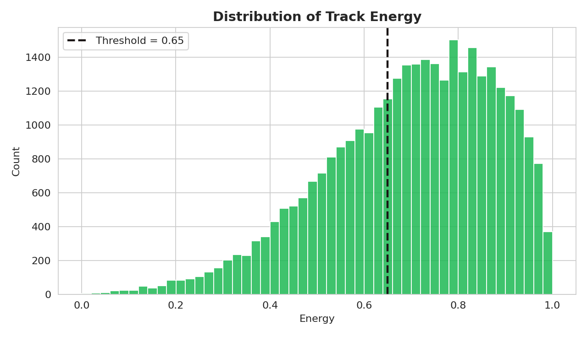
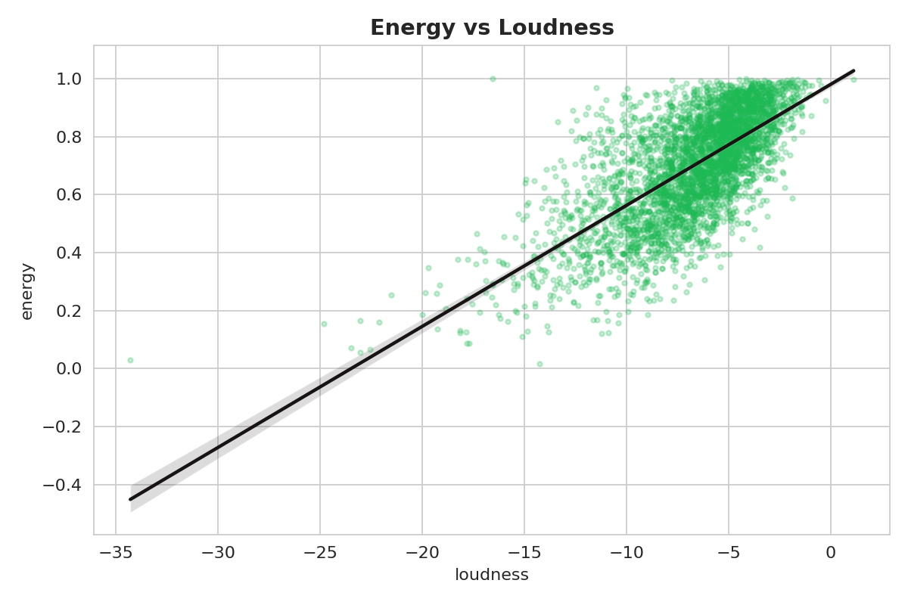
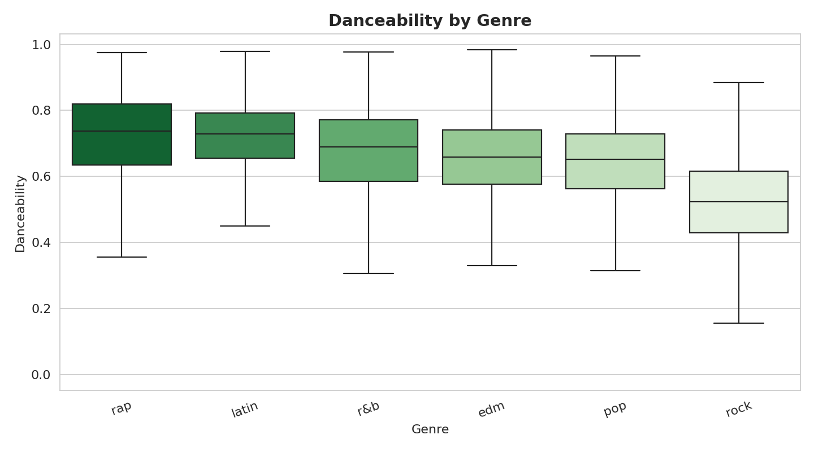
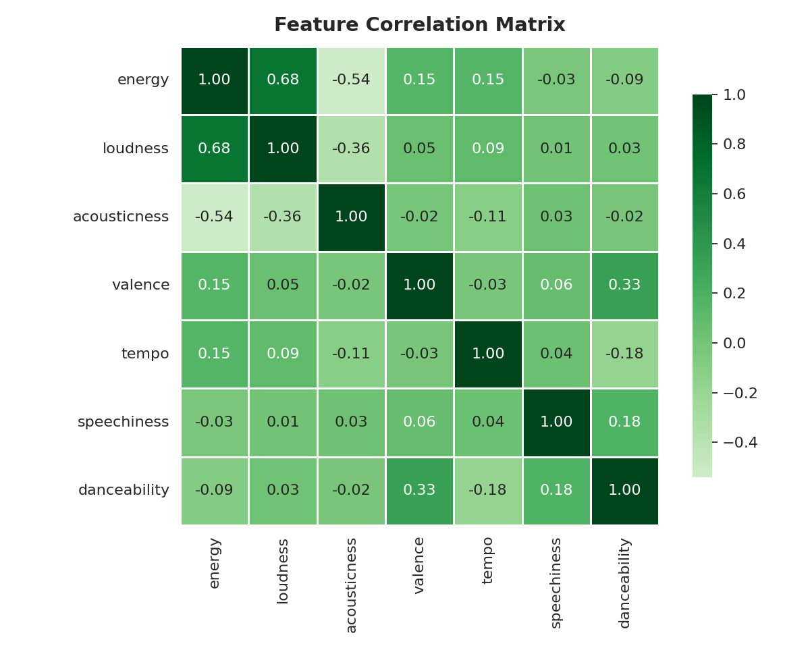

# 🎵 Song Energy Classifier

> Predicting whether a song is **High Energy** or **Low Energy** from its audio features, using classical machine learning on 30,000+ Spotify tracks.

<p align="center">
  
  
  
  
  
  
</p>

---

## 📖 Overview

Music streaming platforms rely heavily on understanding *how a song feels* to build smart recommendations and dynamic playlists. **Energy** — the perceived intensity and activity of a track — is one of the most important "vibe" signals behind that experience.

This project frames energy prediction as a **binary classification** problem (`High Energy` vs `Low Energy`) and benchmarks five classical machine-learning algorithms against the same dataset and train/test split. Each model is implemented in **both Python (scikit-learn)** and **R (caret / e1071)** for cross-validation of results.

**Key idea:** A small, interpretable set of audio features — *loudness, acousticness, valence, tempo,* and *speechiness* — is enough to classify a track's energy with high accuracy, with **loudness** consistently emerging as the single most influential feature.

---

## 📊 Results at a Glance

The best performing model, **K-Nearest Neighbors**, reached **81.10% accuracy** on the held-out test set after hyperparameter tuning.

<p align="center">
  
</p>

| Model | Test Accuracy | Configuration |
|-------|:------------:|---------------|
| 🥇 **K-Nearest Neighbors** | **81.10%** | Grid search over `k = 1…10`, 5-fold cross-validation |
| 🥈 Support Vector Machine | 79.07% | Linear kernel, default hyperparameters |
| 🥉 Random Forest | 77.37% | Default params, `random_state = 42` |
| Logistic Regression | 75.05% | `liblinear` solver, binary classification |
| Gaussian Naive Bayes | 74.36% | Default Gaussian NB |

> 📌 KNN additionally achieved **~83% precision** and **~89% recall**, making it the strongest overall classifier in this study.

<p align="center">
  
</p>

---

## 🔍 Exploratory Data Analysis

<table>
  <tr>
    <td align="center"><br><sub>Energy distribution & decision threshold</sub></td>
    <td align="center"><br><sub>Energy vs. Loudness (strong positive correlation)</sub></td>
  </tr>
  <tr>
    <td align="center"><br><sub>Danceability across genres</sub></td>
    <td align="center"><br><sub>Feature correlation matrix</sub></td>
  </tr>
</table>

The EDA confirmed that **loudness** is highly correlated with energy, while **acousticness** is strongly *negatively* correlated — louder, less acoustic tracks tend to be perceived as more energetic. These insights directly informed feature selection.

---

## 🧪 Methodology

**1. Data Preparation**
- Source: `spotify_songs.csv` — **32,833 tracks** across 6 genres (pop, rap, rock, latin, R&B, EDM).
- The continuous `energy` value is binarized into **High (1)** / **Low (0)** using a threshold on the energy score.
- Rows with missing/corrupt values are removed.

**2. Feature Selection**
Five audio features known to influence perceived energy:
`loudness` · `acousticness` · `valence` · `tempo` · `speechiness`

**3. Preprocessing**
- **Min-Max scaling** applied to numeric features so all values lie in `[0, 1]` — critical for distance-based models like KNN.

**4. Training & Evaluation**
- **80 / 20** train–test split (KNN tuned with 5-fold cross-validation).
- Metrics: **Accuracy, Precision, Recall, F1-score,** and **Confusion Matrix**.
- Feature importance examined per model.

---

## 🗂️ Repository Structure

```
Song_Energy_Classifier/
├── README.md                          # You are here
├── spotify_songs.csv                  # Dataset (32,833 tracks)
│
├── notebooks (Python / scikit-learn)
│   ├── Knn.ipynb                      # K-Nearest Neighbors + Decision Tree
│   ├── LR_RF.ipynb                    # Logistic Regression + Random Forest
│   └── SVM_NB.ipynb                   # SVM + Gaussian Naive Bayes
│
├── scripts (R / caret · e1071)
│   ├── Song_Energy_Classifier.R       # KNN pipeline in R
│   └── Project SVM_NB.R               # SVM + Naive Bayes in R
│
├── Song_Energy_Classifer_Report.pdf   # Full written report
├── ML final project (2).pptx          # Presentation slides
│
└── assets/
    ├── images/                        # Generated charts (used in this README)
    └── report_figures/                # Figures extracted from the report
```

---

## 🚀 Getting Started

### Python

```bash
# 1. Clone the repository
git clone https://github.com/<your-username>/Song_Energy_Classifier.git
cd Song_Energy_Classifier

# 2. Install dependencies
pip install pandas numpy scikit-learn matplotlib seaborn jupyter

# 3. Launch the notebooks
jupyter notebook
```

Open any of `Knn.ipynb`, `LR_RF.ipynb`, or `SVM_NB.ipynb` and run all cells.

### R

```r
install.packages(c("caret", "class", "e1071", "naivebayes",
                   "ggplot2", "GGally", "caTools", "gmodels", "readr"))
source("Song_Energy_Classifier.R")
```

---

## 🛠️ Tech Stack

| Language | Libraries |
|----------|-----------|
| **Python** | pandas · NumPy · scikit-learn · matplotlib · seaborn |
| **R** | caret · class · e1071 · naivebayes · ggplot2 · GGally |

---

## 💡 Key Takeaways

- **Loudness is king.** Across every model, loudness was the dominant predictor of energy, followed by acousticness and valence.
- **Simple beats complex here.** A well-tuned KNN outperformed more complex ensembles, thanks to clear feature separations after normalization.
- **Normalization matters.** Min-Max scaling was essential for distance-based models — without it, large-scale features like tempo would dominate the distance metric.

## 🔮 Future Work

- Incorporate **real-time user feedback** and mood detection for adaptive playlisting.
- Explore **gradient boosting** (XGBoost / LightGBM) and lightweight neural networks.
- Extend from binary to **multi-class** energy bucketing (e.g., low / medium / high).

---

## 📄 Report & Slides

A detailed write-up of the methodology, experiments, and per-model evaluation is available in **[`Song_Energy_Classifer_Report.pdf`](Song_Energy_Classifer_Report.pdf)**, with a summary deck in **`ML final project (2).pptx`**.

## 📚 Data Source

Spotify Songs dataset (~32k tracks) sourced from Kaggle, originally collected via the Spotify Web API.

## 📝 License

Released under the **MIT License** — feel free to use, modify, and build on this work.
